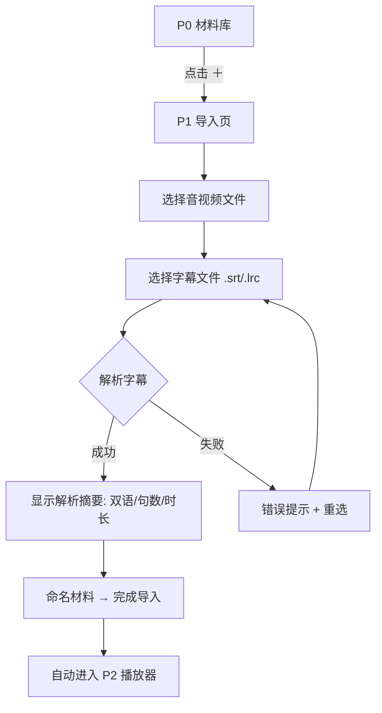
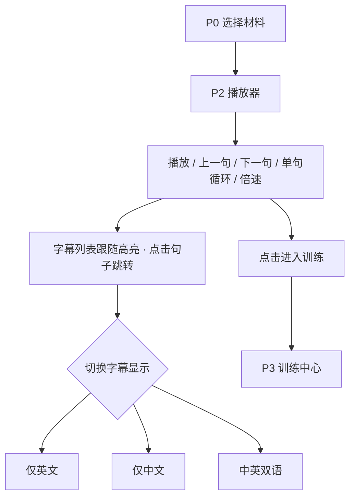
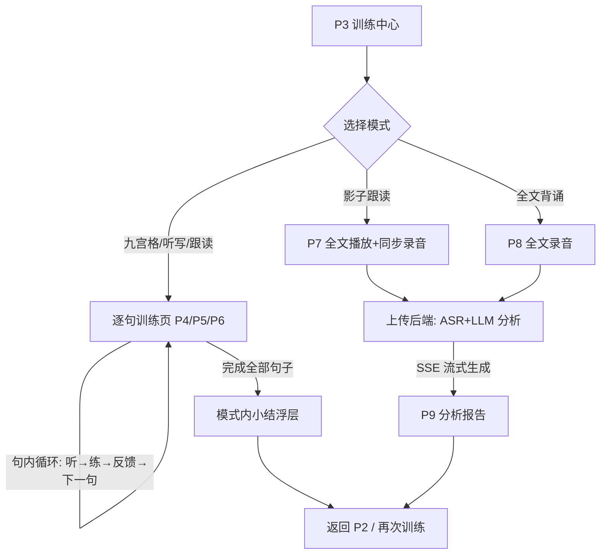
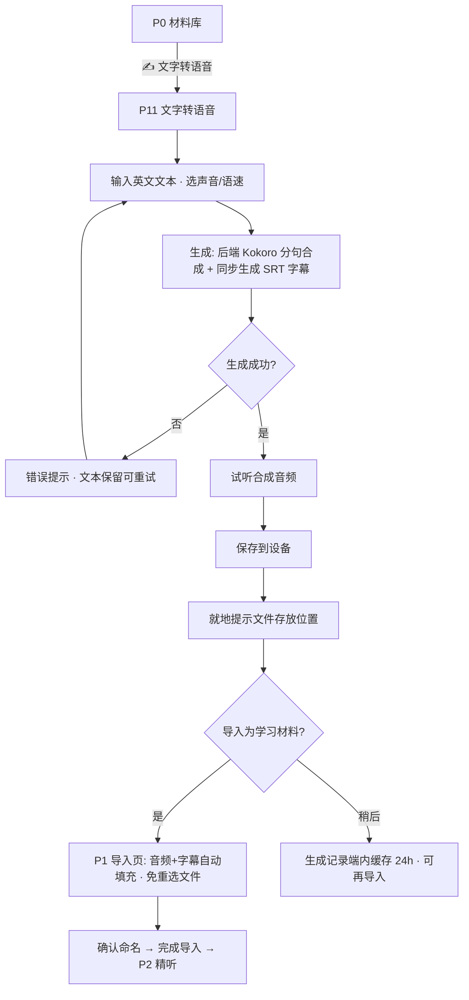

# 英语学习助手 · 原型设计

> 版本：v1.1 · 状态：待评审
> 变更记录：v1.1（2026-08-24）新增「文字转语音（Kokoro-82M）」功能——P11 页面、§3.4 流程、P0/P1 入口与自动填充、§7 保存差异
> 设计依据：《技术选型报告》（docs/技术选型报告.md）、brainstorming.txt 原始需求
> 配套文档：《系统架构设计》（docs/系统架构设计.md）

---

## 1. 概述

### 1.1 产品定位与范围

面向英语精听/跟读训练的学习工具，支持 **PC Web、移动 H5、微信小程序** 三端。用户导入本地音视频与字幕文件（.srt / .lrc），以"逐句"为最小学习单元，进行精听与五种训练（九宫格、单句听写、跟读评分、影子跟读、全文背诵）。此外提供「文字转语音」工具：输入英文文本经 Kokoro-82M 合成音频并保存到用户设备，可一键导入为学习材料（v1.1 新增）。

本文档覆盖 MVP 全部页面的信息架构、用户流程、线框布局、交互规格与三端差异，可直接指导 UI 开发与评审。

### 1.2 设计原则

| 原则 | 说明 |
|------|------|
| 句子是核心对象 | 所有播放控制、字幕展示、训练模式都围绕 `SubtitleSentence`（一句一行、逐句跳转、逐句循环）展开 |
| 播放页是中枢 | 精听播放器是唯一常驻主界面，训练模式均从播放页进入，训练结束可一键返回继续精听 |
| 三端同一信息架构 | 页面结构、导航层级、交互语义三端一致；仅布局密度与平台能力有差异（见 §8） |
| 本地优先 | 材料文件存于端内本地，无需注册登录；仅训练评测链路联网 |
| 单手可达（移动端） | 核心播放控制固定在拇指热区（屏幕下 1/3），字幕列表可单手滑动 |

### 1.3 三端布局策略

| 端 | 视口特征 | 布局策略 |
|----|---------|---------|
| PC Web | 宽屏（≥1024px）横置 | 播放页采用 **左右分栏**：左侧视频+控制条（约 62%），右侧字幕列表（约 38%）；支持键盘快捷键 |
| 移动 H5 | 窄屏竖置，浏览器壳 | **上下结构**：视频区（音频时为封面区）→ 控制条 → 字幕列表占剩余高度；底部无 Tab（H5 用路由导航） |
| 微信小程序 | 窄屏竖置，原生导航栏 | 布局同移动 H5；底部原生 TabBar（材料 / 我的）；播放器用原生 `<video>` 全屏能力兜底 |

---

## 2. 信息架构

### 2.1 页面地图

```
材料库 P0（首页）
├── 导入材料 P1（本地选择 / TTS 一键带入）
├── 文字转语音 P11（v1.1 新增）
├── 精听播放器 P2（按材料进入）
│   └── 训练中心 P3（选择模式与范围）
│       ├── 九宫格 P4
│       ├── 单句听写 P5
│       ├── 跟读评分 P6
│       ├── 影子跟读 P7 ──→ 分析报告 P9
│       └── 全文背诵 P8 ──→ 分析报告 P9
└── 我的/设置 P10
```

| 编号 | 页面 | 路由（uni-app） | 端内导航入口 |
|------|------|----------------|--------------|
| P0 | 材料库 | `pages/index/index` | 启动页 / Tab"材料" |
| P1 | 导入材料 | `pages/import/index` | P0 右上角 [＋] |
| P2 | 精听播放器 | `pages/player/index?materialId=` | P0 点击材料卡片 |
| P3 | 训练中心 | `pages/training/index?materialId=` | P2 [进入训练] 按钮 |
| P4 | 九宫格 | `pages/training/puzzle` | P3 |
| P5 | 单句听写 | `pages/training/dictation` | P3 |
| P6 | 跟读评分 | `pages/training/read-aloud` | P3 |
| P7 | 影子跟读 | `pages/training/shadowing` | P3 |
| P8 | 全文背诵 | `pages/training/recitation` | P3 |
| P9 | 分析报告 | `pages/training/report` | P7/P8 完成后自动跳转 |
| P10 | 我的/设置 | `pages/settings/index` | Tab"我的" / P0 设置入口 |
| P11 | 文字转语音 | `pages/tts/index` | P0 [✍ 文字转语音] 入口（v1.1 新增） |

### 2.2 导航设计

- **小程序**：原生 TabBar 两个 Tab——`材料`（P0）、`我的`（P10）。其余页面均为 push 层级页，左上角系统返回。
- **移动 H5**：无 TabBar，P0 顶部栏右侧放 [设置] 图标进入 P10；其余与小程序一致。
- **PC Web**：顶部全局栏（产品名 + 设置入口），页面内容区居中限宽（最大 1440px）。无左侧导航树——页面层级浅，不需要。
- **返回逻辑**：P9 分析报告"返回"回到 P2 播放器（而非 P3），保证"训练完继续精听"的动线最短。

---

## 3. 核心用户流程

### 3.1 导入学习材料流程



**关键交互说明**：
- 文件选择方式三端不同（见 §8）：PC/H5 用系统文件选择器（支持拖拽），小程序用 `wx.chooseMessageFile`（会话文件）与 `wx.chooseMedia`（相册视频）。
- 字幕解析在选择文件后**即时完成**（纯前端自研解析器，零网络请求），摘要包含：格式（SRT/LRC）、是否双语、句子数、总时长。
- 音视频与字幕时长偏差 >5s 时给出警告条（"字幕与媒体时长可能不匹配"），不阻断导入。

### 3.2 精听学习流程



### 3.3 训练流程总览



### 3.4 文字转语音与导入流程（v1.1 新增）



**关键交互说明**：
- 字幕时间轴来自分句合成的真实边界（非 ASR 推断），导入后即支持逐句跳转/循环/训练，见《系统架构设计》§5.5。
- "保存到设备"与"导入材料"是两个独立动作：保存面向用户自有文件管理；导入面向 App 内学习闭环，产物经 FileSaver 适配层落地（三端差异见 §7）。

---

## 4. 页面线框设计

### 4.1 P0 材料库（首页）

**页面目标**：展示已导入材料，一键继续上次学习；导入新材料。

**PC Web 线框**：

```
┌────────────────────────────────────────────────────────────────────────┐
│  英语精听助手                                                    [⚙设置]│
├────────────────────────────────────────────────────────────────────────┤
│  材料库                                  [✍ 文字转语音]  [＋ 导入材料]│
│  ┌──────────────────────────────────────────────────────────┐          │
│  │  🔍 搜索材料名称…                            排序: 最近学习 ▾│          │
│  └──────────────────────────────────────────────────────────┘          │
│  ┌──────────────┐  ┌──────────────┐  ┌──────────────┐  ┌──────────────┐│
│  │ 🎬           │  │ 🎵           │  │ 🎵           │  │ 🎬           ││
│  │ 真题模拟 001  │  │ TED 演讲精选  │  │ BBC 六分钟   │  │ 电影片段-01  ││
│  │ 视频·双语    │  │ 音频·双语    │  │ 音频·仅英文  │  │ 视频·双语    ││
│  │ 12:05        │  │ 18:30        │  │ 06:12        │  │ 04:48        ││
│  │ ▓▓▓▓▓░░░ 65% │  │ ▓▓░░░░░░ 30% │  │ ░░░░░░░░ 0%  │  │ ▓▓▓▓▓▓░ 100% ││
│  │ 昨天学过     │  │ 2 天前       │  │ 从未学习     │  │ 已完成 ✓     ││
│  └──────────────┘  └──────────────┘  └──────────────┘  └──────────────┘│
└────────────────────────────────────────────────────────────────────────┘
```

**移动 H5 / 小程序线框**：

```
┌──────────────────────────┐
│ 材料库           [✍]  [＋]│
├──────────────────────────┤
│ ┌──────────────────────┐ │
│ │🎬 真题模拟 001        │ │
│ │   视频·双语·12:05     │ │
│ │   ▓▓▓▓▓░░░ 65%·昨天   │ │
│ ├──────────────────────┤ │
│ │🎵 TED 演讲精选        │ │
│ │   音频·双语·18:30     │ │
│ │   ▓▓░░░░░░ 30%·2天前  │ │
│ ├──────────────────────┤ │
│ │🎵 BBC 六分钟英语      │ │
│ │   音频·仅英文·06:12   │ │
│ │   从未学习            │ │
│ └──────────────────────┘ │
├──────────────────────────┤
│  [材料]            [我的]│  ← 仅小程序显示原生 TabBar
└──────────────────────────┘
```

**元素清单**：

| 元素 | 说明 | 交互 |
|------|------|------|
| 材料卡片/条目 | 图标区分视频🎬/音频🎵；徽标区分 双语/仅英文/仅中文 | 点击 → P2 播放器；长按（移动端）/右键（PC）→ 重命名 / 删除 |
| 学习进度条 | `已学句数 / 总句数`，"已学"= 在任意训练或精听中播放过的句子 | 只读展示 |
| [＋ 导入材料] | 主按钮 | → P1 |
| [✍ 文字转语音] | 次按钮（移动端为图标按钮 [✍]） | → P11（v1.1 新增） |
| 空态 | 插画 + "还没有学习材料" + [立即导入] | → P1 |
| 搜索/排序 | PC 端显示；移动端 MVP 不做（材料量少） | 实时过滤 / 按最近学习、名称排序 |

### 4.2 P1 导入材料

**页面目标**：两步选文件（媒体 + 字幕），即时解析校验，命名后入库。

**线框（移动端；PC 端为居中 480px 表单，结构相同）**：

```
┌──────────────────────────┐
│ ←  导入材料              │
├──────────────────────────┤
│ ① 选择音视频文件 *        │
│ ┌──────────────────────┐ │
│ │      📁 点击选择      │ │
│ │ 支持 mp3 wav m4a     │ │
│ │      mp4 mov 等       │ │
│ └──────────────────────┘ │
│ ✓ family_excursions.mp4   │
│   视频 · 12:05 · 86MB     │
│                          │
│ ② 选择字幕文件 *          │
│ ┌──────────────────────┐ │
│ │      📄 点击选择      │ │
│ │   支持 .srt / .lrc   │ │
│ └──────────────────────┘ │
│ ✓ audio_原文和译文.srt    │
│   双语字幕 · 86 句 ✓解析成功│
│ ┌──────────────────────┐ │
│ │⚠ 字幕末句 11:58 与媒体 │ │  ← 仅偏差>5s 时显示
│ │  时长 12:05 略有偏差   │ │
│ └──────────────────────┘ │
│                          │
│ ③ 材料名称                │
│ ┌──────────────────────┐ │
│ │ 真题模拟 001          │ │  ← 默认取文件名
│ └──────────────────────┘ │
│                          │
│ ┌──────────────────────┐ │
│ │       完成导入        │ │  ← ①② 均成功前置灰
│ └──────────────────────┘ │
└──────────────────────────┘
```

**元素清单与校验规则**：

| 元素 | 校验/说明 |
|------|-----------|
| 媒体文件选择 | 校验扩展名 + MIME；超出端内可播放格式时提示"该格式可能无法播放" |
| 字幕文件选择 | 即时解析：成功 → 绿色摘要（格式/双语/句数/总时长）；失败 → 红字错误原因（如"时间戳格式无法识别，第 12 行"）+ 允许重选 |
| 材料名称 | 默认取媒体文件名（去扩展名），可编辑，1-50 字 |
| [完成导入] | 写入本地材料库 → 自动跳转 P2 开始播放 |
| TTS 一键带入（v1.1） | 从 P11 跳转（`?source=tts&taskId=`）时 ①② 自动填充并显示"由文字转语音生成"徽标；音频/字幕直接取端内临时产物，无需用户重选文件；用户仅需确认名称后完成导入 |

### 4.3 P2 精听播放器（核心页）

**页面目标**：逐句精听的中枢页面——播放控制、双语字幕、滚动字幕列表三位一体。

**PC Web 线框（左右分栏）**：

```
┌──────────────────────────────────────────────────────────────────────────┐
│ ←   真题模拟 001 - Family Excursions                        [⚡进入训练] │
├──────────────────────────────────────────────────────┬───────────────────┤
│                                                      │ 字幕  [英|中|双语] │
│  ┌──────────────────────────────────────────────┐    │ ┌───────────────┐ │
│  │                                              │    │ │ 1 · 00:02     │ │
│  │                  视 频 画 面                  │    │ │ You should... │ │
│  │                                              │    │ │ 你应该边听…   │ │
│  │   ┄┄ 内嵌字幕区（视频画面底部，可开关）┄┄     │    │ ├───────────────┤ │
│  │                                              │    │ │▶2 · 00:09 高亮 │ │
│  └──────────────────────────────────────────────┘    │ │ For each...   │ │
│  ▶ ──────────────●──────────────────  03:24 / 12:05  │ │ 对于每个问题… │ │
│                                                      │ ├───────────────┤ │
│  [⏮ 上一句] [▶ 播放] [⏭ 下一句] [🔁 单句循环: 关▾]    │ │ 3 · 00:15     │ │
│  [1.0x ▾]                          [字幕CC] [🔊──][⛶]│ │ You will hear…│ │
│                                                      │ │ 你将听到…     │ │
│  ┌──────────────────────────────────────────────┐    │ │ …自动滚动跟随…│ │
│  │ 当前句 · For each question, you should...    │    │ │               │ │
│  │          对于每个问题，你应该…     [⭐收藏]    │    │ │               │ │
│  └──────────────────────────────────────────────┘    │ └───────────────┘ │
├──────────────────────────────────────────────────────┴───────────────────┤
│  快捷键: 空格 播放/暂停 · ←→ 上/下一句 · R 单句循环 · ↑↓ 音量 · 1/2 倍速   │
└──────────────────────────────────────────────────────────────────────────┘
```

**移动 H5 / 小程序线框（上下结构）**：

```
┌──────────────────────────┐
│ ← 真题模拟 001    [⚡训练]│
├──────────────────────────┤
│ ┌──────────────────────┐ │
│ │      视 频 画 面      │ │  ← 音频材料时替换为
│ │  ┄内嵌字幕(底部)┄    │ │     封面+材料信息卡
│ └──────────────────────┘ │
│ ▶ ──────●──── 03:24/12:05│
│ ┌──────────────────────┐ │
│ │[⏮] [▶] [⏭] [🔁] [1.0x▾]│ │  ← 控制条: 拇指热区
│ │     [字幕:双语▾] [🔊]   │ │
│ └──────────────────────┘ │
│ ┈ 字幕列表 · 一句一条 ┈   │
│ ┌──────────────────────┐ │
│ │ 1·00:02 You should…  │ │
│ │   你应该边听边回答…   │ │
│ │▶2·00:09 For each…     │ │ ← 当前句: 高亮+置顶滚动
│ │   对于每个问题…       │ │
│ │ 3·00:15 You will…    │ │
│ │   你将听到…          │ │
│ │        …             │ │ ← 占满剩余高度, 可滚动
│ └──────────────────────┘ │
├──────────────────────────┤
│  [材料]            [我的]│  ← 仅小程序
└──────────────────────────┘
```

**元素清单**：

| 区域 | 元素 | 说明与交互 |
|------|------|-----------|
| 媒体区 | 视频画面 / 音频封面卡 | 音频材料显示 🎵 + 材料名 + 句数/时长；小程序视频单击全屏（原生能力） |
| 媒体区 | 内嵌字幕层 | 视频画面底部叠加当前句字幕；开关 = [字幕CC] 按钮；三态与列表联动 |
| 进度条 | 总进度 + 时间 | 可拖拽 seek；句边界不做刻度（避免视觉噪音） |
| 控制条 | ⏮ 上一句 | seek 到 `sentences[i-1].startMs` 并播放；首句时置灰 |
| 控制条 | ▶/⏸ 播放暂停 | 主按钮，尺寸大于其他按钮 |
| 控制条 | ⏭ 下一句 | seek 到 `sentences[i+1].startMs` 并播放；末句时置灰 |
| 控制条 | 🔁 单句循环 | 点击切换 关→1次→3次→∞；开启时对当前句设置 A-B loop |
| 控制条 | 倍速 | 0.5 / 0.75 / 1.0 / 1.25 / 1.5 / 2.0，底部弹层选择 |
| 控制条 | 字幕显示 | 三态循环：双语→仅英→仅中；同步影响内嵌字幕与字幕列表 |
| 控制条 | 音量（PC） | 滑杆；移动端用系统音量，仅留静音按钮 |
| 字幕列表 | 句子条目 | 序号+起始时间+文本；点击 → seek 到该句并播放；长按 → 收藏/复制 |
| 字幕列表 | 当前句高亮 | 播放中二分查找定位；变化时平滑滚动至列表可视区 1/3 处 |
| 当前句卡片 | PC 端专属 | 大字展示当前句双语 + [⭐收藏] + [⚡就练这句]（直达 P4/P5/P6 对应句） |

**状态与边界**：
- 字幕为空（解析 0 句）：字幕列表区显示空态，播放控制退化为普通播放器（隐藏 ⏮/⏭/🔁）。
- 非双语字幕：[字幕] 按钮变为 开/关 两态。
- 小程序 seek 精度偏差：视觉无感知处理，属架构层时间补偿（见《系统架构设计》§5.1）。

### 4.4 P3 训练中心

**页面目标**：选择训练模式与训练范围，展示各模式历史成绩。

**线框（移动端；PC 端居中 640px）**：

```
┌──────────────────────────┐
│ ←  选择训练模式           │
├──────────────────────────┤
│ 材料: 真题模拟 001        │
│ 范围: [全文 86 句      ▾] │  ← 可选: 全文 / 收藏句(12)
│                          │
│ ┌──────────────────────┐ │
│ │ 🧩 九宫格             │ │
│ │ 选词拼句 · 巩固句型结构│ │
│ │ 上次: 正确率 90%      │ │
│ ├──────────────────────┤ │
│ │ ✍️ 单句听写           │ │
│ │ 听音写句 · 提升听辨    │ │
│ │ 上次: 正确率 85%      │ │
│ ├──────────────────────┤ │
│ │ 🎤 跟读评分           │ │
│ │ 逐句跟读 · AI 发音评分 │ │
│ │ 上次: 平均分 82       │ │
│ ├──────────────────────┤ │
│ │ 🗣️ 影子跟读           │ │
│ │ 全文同步跟读 · LLM 分析│ │
│ │ 上次: 综合 80 分      │ │
│ ├──────────────────────┤ │
│ │ 📖 全文背诵           │ │
│ │ 背诵全文 · LLM 评估建议│ │
│ │ 尚未练习              │ │
│ └──────────────────────┘ │
└──────────────────────────┘
```

| 元素 | 说明 |
|------|------|
| 范围选择 | `全文 N 句` / `收藏句 M 句`（M=0 时禁用并提示"先去精听页收藏句子"）；九宫格/听写/跟读按此范围逐句出题 |
| 模式卡片 | 图标 + 名称 + 一句话说明 + 上次成绩（无成绩显示"尚未练习"） |
| 影子跟读/全文背诵 | 始终使用全文范围，选择"收藏句"时该两项置灰并附说明 |

### 4.5 P4 九宫格训练

**页面目标**：将当前句按空格拆成词块并打乱，用户按正确语序点选拼句。

**线框（移动端；PC 端居中 720px，词块一行排更多）**：

```
┌──────────────────────────┐
│ ← 九宫格            3/20 │
├──────────────────────────┤
│ 进度 ▓▓░░░░░░░░  第 3 句  │
│ ┌──────────────────────┐ │
│ │  [🔊 重听原句]  1.0x▾ │ │  ← 点击播放当前句
│ └──────────────────────┘ │
│ 拼句区（按语序点选）:      │
│ ┌──────────────────────┐ │
│ │ You should ▢ ▢ ▢ ▢ ▢ │ │  ← 已选词块按序排列,
│ └──────────────────────┘ │     点已选词可撤回
│ 候选词块:                 │
│ ┌───────┐┌───────┐┌─────┐│
│ │answer ││ as    ││listen│
│ └───────┘└───────┘└─────┘│
│ ┌───────┐┌───────┐┌─────┐│
│ │questions│ the   ││ to  ││
│ └───────┘└───────┘└─────┘│
│ ┌───────┐┌───────┐┌─────┐│
│ │ you   ││(已选灰)│     ││
│ └───────┘└───────┘└─────┘│
│ [🗑清空] [💡提示]  [✓提交] │
├──────────────────────────┤
│ 结果浮层（提交后）:        │
│ ✅ 完全正确！+10 分        │
│ ❌ 第 3 词应为 answer      │
│ [重试本句]      [下一句 →] │
└──────────────────────────┘
```

**规则与交互**：

| 项 | 规格 |
|----|------|
| 词块生成 | 取 `SubtitleSentence.words`（英文按空格拆分），随机打乱；词数 ≤9 用 3×3 宫格，>9 自动扩展行数保持 3 列（PC 5 列），词数 >15 时拆分标点短语块，保证单屏可操作 |
| 点选 | 点击候选词 → 上屏到拼句区并置灰候选位；点击拼句区词块 → 撤回 |
| 💡提示 | 揭示下一个正确词（扣 2 分），每句最多 3 次 |
| 提交判定 | 全对 → 得分 +10；有错 → 标红首个错误位，允许原位修正（每句最多 2 次提交） |
| 完成小结 | 全部句子完成后浮层：正确率、用时、[再来一轮]/[返回] |

### 4.6 P5 单句听写

**页面目标**：播放单句 → 用户输入完整句子 → 逐词对比反馈。

```
┌──────────────────────────┐
│ ← 单句听写          5/20 │
├──────────────────────────┤
│ ┌──────────────────────┐ │
│ │   ▶ [🔊 播放句子]     │ │
│ │   已播放 2 次 · 1.0x▾ │ │  ← 不限播放次数,
│ └──────────────────────┘ │     记录次数用于小结
│ 听写输入:                 │
│ ┌──────────────────────┐ │
│ │ You should answer the│ │
│ │ questions as you lis_│ │
│ └──────────────────────┘ │
│ [🗑清空]        [✓核对答案]│
│ ┈ 核对结果（提交后展开）┈  │
│ 你的答案 vs 原文:          │
│ You should answer the    │
│ questions as you lis ten.│
│                  ~~lis~~  │ ← 缺词/错词标红删除线,
│                  +listen+ │   正确词绿色插入标记
│ 本句正确率 92%            │
│ [🔊重听] [↻重写] [下一句→]│
└──────────────────────────┘
```

**规则与交互**：

| 项 | 规格 |
|----|------|
| 播放 | 播放 `[startMs, endMs]` 区间一遍；可无限重听，倍速可调；播放次数计入小结 |
| 输入 | 多行输入框，自动小写化、忽略多余空格与标点差异（对比算法见《系统架构设计》§2.5） |
| 对比展示 | 逐词 diff：正确词不变色、错词红色删除线、漏词绿色插入号、多词灰色 |
| 小结浮层 | 平均正确率、总播放次数、最弱句 TOP3（可点回该句重练） |

### 4.7 P6 跟读评分

**页面目标**：逐句听原音 → 跟读录音 → 腾讯云智聆 SOE 发音评分 → 音素级反馈。

```
┌──────────────────────────┐
│ ← 跟读评分          3/20 │
├──────────────────────────┤
│ ┌──────────────────────┐ │
│ │ You should answer the│ │
│ │ questions as you     │ │
│ │ listen.              │ │
│ │ 你应该边听边回答问题。│ │  ← 可按字幕三态开关
│ └──────────────────────┘ │
│ [🔊 听原音]       [1.0x▾] │
│                          │
│        ┌────────┐        │
│        │   🎤   │        │
│        │ 按住说话│        │  ← 按住录音/松开结束;
│        └────────┘        │     或点击开始再点结束
│      00:03.2 ● 录音中    │
│ ┈ 评分结果（完成后展开）┈  │
│      综合 82 分           │
│ 准确度 ████████░░ 85      │
│ 流利度 ███████░░░ 78      │
│ 完整度 █████████░ 90      │
│ You should answer the    │
│ questions as you listen. │
│       ~~^^~~              │ ← 低分词/音素标红,
│       /ˈæn.sɚ/ 注意 /æ/   │   点击词看音标建议
│ [↻再读一次]  [▶听我录音]  │
│                   [下一句→]│
└──────────────────────────┘
```

**规则与交互**：

| 项 | 规格 |
|----|------|
| 录音 | 最长 60s 自动停止；录音格式 PCM 16kHz（三端统一约定，见《系统架构设计》§2.3） |
| 评分链路 | 小程序端 SOE SDK 直连；Web/H5 端走后端代理（见《系统架构设计》§5.3） |
| 结果展示 | 综合分 + 准确度/流利度/完整度三维条形图 + 单词级标色（低于阈值标红）+ 点击单词弹音素建议 |
| 无麦克风权限 | 引导浮层：说明用途 + 跳转系统设置（小程序 `wx.openSetting`） |

### 4.8 P7 影子跟读

**页面目标**：全文播放 + 同步录音（边播边录），结束后上传后端做 ASR + LLM 分析。

```
┌──────────────────────────┐        ┌──────────────────────────┐
│ ← 影子跟读                │        │ ← 影子跟读 · 分析中       │
├──────────────────────────┤        ├──────────────────────────┤
│ 材料: 真题模拟 001        │        │ ① 上传录音      ✓ 完成    │
│ 时长: 12:05 · 86 句       │        │ ② 语音转写      ✓ 完成    │
│ ┌──────────────────────┐ │        │ ③ AI 分析中…    ▓▓▓░░    │
│ │ ⚠ 建议佩戴耳机进行    │ │        │ ┌──────────────────────┐ │
│ │   跟读，避免回声干扰  │ │   →    │ │ 已识别: "You should  │ │
│ └──────────────────────┘ │        │ │ answer the..." (流式)│ │
│ 准备就绪后点击开始:        │        │ └──────────────────────┘ │
│ ┌──────────────────────┐ │        └──────────────────────────┘
│ │   ▶ 开始跟读          │ │
│ └──────────────────────┘ │        （分析完成自动跳转 P9 报告）
│ ── 跟读中状态 ──          │
│ ▶ 播放中 03:24 / 12:05    │
│ ● 录音中 03:18            │
│ ────────●─────────        │
│ 当前句(可选显示):          │
│ For each question...      │
│ [⏸ 暂停]      [■ 结束分析]│
└──────────────────────────┘
```

**规则与交互**：

| 项 | 规格 |
|----|------|
| 开始前 | 强制阅读耳机提示（每次进入显示，可勾选"不再提示"）；检测麦克风权限 |
| 跟读中 | 播放与录音同时启动；可暂停（播放与录音同时暂停）、可提前结束；当前句字幕显示可开关（默认关，避免"看读"代替"听读"） |
| 时长限制 | 最长录音 10 分钟（小程序 RecorderManager 上限）；到达上限自动结束并提示 |
| 分析中 | 分步进度（上传→转写→分析）；LLM 输出 SSE 流式渲染；可后台等待，完成推送（小程序订阅消息，后续迭代） |

### 4.9 P8 全文背诵

**页面目标**：不播放原音，用户凭记忆背诵全文并录音，结束后 LLM 对比原文评估。

```
┌──────────────────────────┐
│ ← 全文背诵                │
├──────────────────────────┤
│ 提示模式: [中文提示 ▾]    │  ← 中文提示 / 首词提示 / 无提示
│ ┌──────────────────────┐ │
│ │ 1. 你应该边听边回答…  │ │
│ │ 2. 对于每个问题，你…  │ │
│ │ 3. 你将听到…         │ │  ← 提示模式=中文时列中文;
│ │ …（随录音进度可滚动） │ │     首词时列 "You… / For…"
│ └──────────────────────┘ │
│        ┌────────┐        │
│        │   🎤   │        │
│        │ ● 录音中│        │
│        │  02:31  │        │
│        └────────┘        │
│  [⏸ 暂停]  [✓ 完成背诵]   │
│                          │
│ 说明: 背诵完成后将转写录音 │
│ 并与原文对比，评估完整度   │
└──────────────────────────┘
```

**规则与交互**：

| 项 | 规格 |
|----|------|
| 提示模式 | 中文提示（默认，列 `textZh`）/ 首词提示（列每句首个英文单词）/ 无提示；无中文字幕时中文提示不可选 |
| 录音 | 同 P7 的 10 分钟上限与暂停逻辑 |
| 完成后 | 同 P7 分析流程，LLM 评估维度侧重完整度与记忆准确度 |

### 4.10 P9 分析报告（影子跟读 / 全文背诵共用）

```
┌──────────────────────────┐
│ ← 分析报告 · 影子跟读     │
├──────────────────────────┤
│         ╭──────╮          │
│         │  82  │          │
│         │ 综合分│          │
│         ╰──────╯          │
│ 完整度 ████████░░ 85      │
│ 准确度 ███████░░░ 78      │
│ 流利度 ████████░░ 80      │
│ ┈ AI 详细分析 ┈           │
│ ✅ 做得好的:               │
│  · 前 10 句完整度很高      │
│  · 连读处理自然           │
│ ⚠ 需要改进:               │
│  · 第 12 句漏读了从句部分  │
│  · "answer" 中 /æ/ 发音偏 │ │
│    向 /e/，建议练习...    │
│ 💡 建议:                   │
│  · 建议针对第 12-15 句做   │
│    单句跟读训练           │
│ [▶ 回听我的录音]           │
│ [↻ 再次练习]  [返回精听 →] │
└──────────────────────────┘
```

| 元素 | 说明 |
|------|------|
| 维度条形图 | 完整度/准确度/流利度（背诵模式：完整度/准确度/建议） |
| AI 详细分析 | LLM SSE 流式生成，Markdown 渲染；失败时降级展示 ASR 原文对比（见《系统架构设计》§5.6 降级矩阵） |
| [▶ 回听我的录音] | 播放本次录音（依赖后端开启录音保留配置，默认即用即删、开启后保留 24h） |
| [↻ 再次练习] | 回到对应模式重新开始 |
| [返回精听 →] | 回 P2 播放器 |

### 4.11 P10 我的/设置

```
┌──────────────────────────┐
│ 我的                      │
├──────────────────────────┤
│ 📊 学习统计                │
│ ┌──────────────────────┐ │
│ │ 今日: 精听 25 分钟    │ │
│ │ 本周: 训练 12 次      │ │
│ │ 累计: 材料 4 份      │ │
│ └──────────────────────┘ │
│ ⚙ 播放设置            ›  │  默认倍速 / 循环次数 / 字幕默认三态
│ 🎤 训练设置            ›  │  录音模式(按住/点击) / 耳机提示开关
│ 🗄 存储管理            ›  │  已用空间 / 清理录音缓存
│ ℹ 关于与帮助           ›  │  版本 / 反馈 / 使用指南
├──────────────────────────┤
│  [材料]            [我的] │
└──────────────────────────┘
```

### 4.12 P11 文字转语音（v1.1 新增）

**页面目标**：输入英文文本 → Kokoro-82M 合成 → 试听 → 保存到设备并告知存放位置 → 一键导入为学习材料。

**线框（移动端；PC 端居中 640px，结构相同）**：

```
┌──────────────────────────┐
│ ← 文字转语音              │
├──────────────────────────┤
│ 输入英文文本:              │
│ ┌──────────────────────┐ │
│ │ You should answer the│ │
│ │ questions as you...  │ │
│ └──────────────────────┘ │
│ 128 / 5000 字             │
│ 声音: [美式·Heart(女)   ▾] │
│ 语速: ──────●────── 1.0x  │
│ ☑ 同时生成字幕（SRT）      │
│ ┌──────────────────────┐ │
│ │      ⚡ 开始生成       │ │
│ └──────────────────────┘ │
│ ┈ 生成中 ┈                │
│ 合成第 3/5 句… ▓▓▓░░░      │
│ ┈ 生成完成 ┈              │
│ ▶ ──────●──────── 00:07.5 │
│ [💾 保存到设备]            │
│ ✅ 已保存:                │
│  浏览器下载目录 ~/Downloads│
│  /tts-heart-20260824.wav  │
│  （含同名 .srt 字幕文件） │
│ ┌──────────────────────┐ │
│ │  📥 导入为学习材料      │ │  ← 生成完成后常显主按钮
│ └──────────────────────┘ │
│ 导入后可直接逐句精听与训练， │
│ 字幕已按句自动对齐          │
└──────────────────────────┘
```

**元素清单**：

| 元素 | 说明与交互 |
|------|-----------|
| 文本输入 | 多行输入框，上限 5000 字符，实时字数统计；检测到非英文内容时提示"当前语音模型针对英文优化"，不阻断 |
| 声音选择 | Kokoro 内置声音：af_heart（美式女声·默认）/ af_bella（美式女声）/ am_michael（美式男声）/ bf_emma（英式女声）；点喇叭图标试听小样（现场合成一句固定文本） |
| 语速 | 0.5x–2.0x 滑杆，步进 0.05，默认 1.0 |
| ☑ 同时生成字幕 | 默认开启；开启时生成同名 .srt 字幕，句级时间轴为分句合成真实边界（见《系统架构设计》§3.4 / §5.5） |
| [⚡ 开始生成] | 生成中禁用输入区并显示分句进度（第 n/N 句）；可取消；5000 字约需 10-30s（CPU 推理快于实时） |
| 试听条 | 生成完成后内嵌试听（复用播放控制组件，不进入精听页） |
| [💾 保存到设备] | 保存音频（勾选字幕时一并保存 .srt）；完成后就地展示存放位置（`locationText`，三端机制见 §7）；小程序端弹出系统目录选择 |
| [📥 导入为学习材料] | → P1（`?source=tts&taskId=`），音频与字幕自动填充；生成记录端内缓存 24h，期间可重复导入 |
| 失败态 | 文本保留，Toast 提示 + [重试]；连续失败提示稍后再试（降级策略见《系统架构设计》§5.6） |

---

## 5. 通用组件规格

### 5.1 播放控制条（PlayerControlBar）

| 槽位 | 移动端 | PC 端 |
|------|--------|-------|
| 第一行 | 进度条 + 时间 | 进度条 + 时间 |
| 第二行 | ⏮ ▶ ⏭ 🔁 倍速 | ⏮ ▶ ⏭ 🔁 循环次数 倍速 字幕 音量 全屏 |
| 说明 | 倍速/字幕用底部弹层 | 全部平铺，hover 显示快捷键提示 |

### 5.2 字幕滚动列表（SubtitleList）

- **数据**：一句一条，渲染 `SubtitleSentence`；虚拟滚动（>200 句时启用）。
- **高亮跟随**：`onTimeUpdate` → 二分查找当前句 → index 变化时 `scrollIntoView({block: 'nearest'})` 至可视区上 1/3；用户手动滚动后暂停自动跟随 5s（防止打架），之后恢复。
- **三态渲染**：双语模式每句两行（英上中下）；仅英/仅中单行。内嵌字幕层共用同一切换状态。
- **点击**：seek 该句并播放；**长按**：菜单 [⭐收藏 / 📋复制文本]。

### 5.3 录音按钮（RecordButton）

| 状态 | 视觉 |
|------|------|
| 空闲 | 灰色麦克风图标 + "按住说话" |
| 按住/录音中 | 红色脉冲动画 + 实时时长 + 声波振幅条（音量回调驱动） |
| 近上限 | 剩余 10s 时数字变橙并震动（移动端） |
| 处理中 | 转圈 + "评分中…"，禁用一切点击 |

### 5.4 评分面板（ScorePanel）

综合分环形图 + 三维条形图（准确度/流利度/完整度）+ 单词级标色文本。三训练模式复用，通过 props 控制维度集。

---

## 6. 交互与状态规格

### 6.1 字幕显示三态切换

| 当前态 | 点击后 | 影响范围 |
|--------|--------|----------|
| 双语（默认） | 仅英文 | 视频内嵌字幕 + 字幕列表 + 训练页句子卡片 |
| 仅英文 | 仅中文 | 同上 |
| 仅中文 | 双语 | 同上 |

非双语材料按钮退化为 开/关。全局状态存于 PlayerStore，跨页面保持。

### 6.2 播放状态机

```
idle → loading → ready ⇄ playing ⇄ paused
                     ↘ ended（播完）
playing + loopOn = 单句循环中（A-B loop 激活）
```

- `loopOn` 是修饰态而非独立状态：到达 `endMs` 时 seek 回 `startMs` 继续播放；循环计数（1/3/∞）到数自动解除。
- 任意 seek / 上下句操作不打断 loop 设置，但会重定向循环区间到目标句。

### 6.3 空态与异常态

| 场景 | 处理 |
|------|------|
| 材料库为空 | 插画 + 引导导入 |
| 字幕解析失败 | 导入页就地报错 + 行号提示；不阻断媒体导入（可后续补字幕） |
| 媒体文件损坏/不可播 | 播放器页错误占位 + [重新导入] |
| 麦克风权限拒绝 | 浮层说明 + [去设置] |
| 训练上传/评分网络失败 | Toast + 结果页降级展示（本地保存录音，可重试上传） |
| 小程序切后台 | 音频继续走 `BackgroundAudioManager`（需在设置中开启"后台播放"）；录音任务不受影响（录音中切后台由系统策略中断并提示） |
| TTS 生成失败/超时 | 文本保留 + Toast + [重试]；生成中可取消；字幕生成失败时仍可只保存音频 |

### 6.4 快捷键（PC Web）

| 键 | 功能 | 键 | 功能 |
|----|------|----|------|
| Space | 播放/暂停 | ← / → | 上一句 / 下一句 |
| R | 单句循环开关 | ↑ / ↓ | 音量 ± |
| 1 / 2 | 倍速降/升档 | C | 字幕三态切换 |
| Enter（训练页） | 提交 | Esc | 返回 |

---

## 7. 三端差异一览

| 能力 | PC Web | 移动 H5 | 微信小程序 |
|------|--------|---------|-----------|
| 文件导入 | 文件选择器 + 拖拽 | 文件选择器 | `wx.chooseMessageFile`（会话文件）/ `wx.chooseMedia`（相册视频） |
| 视频组件 | ArtPlayer | ArtPlayer | 原生 `<video>` |
| 音频组件 | Howler.js | Howler.js | `InnerAudioContext` / `BackgroundAudioManager` |
| 录音 | Recorder.js（WAV/PCM） | Recorder.js | `RecorderManager`（PCM 16kHz） |
| 单句听写 ASR | 后端 Whisper 代理 | 后端 Whisper 代理 | wechatSI 插件（免费实时） |
| 跟读评分 | 后端代理 → 腾讯 SOE | 后端代理 → 腾讯 SOE | 腾讯 SOE 小程序 SDK 直连 |
| 全屏视频 | 浏览器全屏 API | 浏览器全屏 API | `<video>` 原生全屏 |
| 导航 | 顶部全局栏 | 顶部栏，无 TabBar | 原生 TabBar（材料/我的） |
| 键盘快捷键 | 全量支持 | 不支持 | 不支持 |
| 媒体存储 | IndexedDB / OPFS | IndexedDB | 小程序本地文件系统（10M+ 用户文件目录） |
| TTS 产物保存（v1.1） | 浏览器下载（`a[download]`）→ 下载目录 | 同左；iOS Safari 存入"文件"App 下载项 | `wx.saveFileToDisk` 用户自选目录（返回 savedFilePath 展示）；旧基础库兜底 `wx.shareFileMessage` 发送到聊天 |

---

## 8. 迭代规划（超出 MVP）

| 阶段 | 内容 |
|------|------|
| V1.1 | 学习统计详情页（图表）；材料云同步（需账号体系） |
| V1.2 | 句子收藏夹独立页；训练成绩趋势；H5 端侧 kokoro-js 离线 TTS（免服务器推理资源，模型首次下载约 90MB） |
| V1.3 | 小程序订阅消息推送训练报告；词典点查（点击字幕单词查释义，LLM 讲解） |

---

## 附：与《系统架构设计》的对应关系

| 本文档 | 架构文档对应章节 |
|--------|-----------------|
| P2 播放控制条、字幕列表 | §2.2 PlayerController 抽象层 |
| 字幕三态、句子高亮 | §2.4 字幕解析模块、§4.1 数据模型 |
| P4 九宫格拆词、P5 听写对比 | §2.5 训练引擎（平台无关层） |
| P6/P7/P8 录音与评分 | §2.3 RecorderController、§3 后端架构、§5 关键链路 |
| §7 三端差异 | §2.1 分层模型、§6 项目目录结构 |
| P11 文字转语音、保存与一键导入 | §2.8 FileSaver 适配层、§3.3-⑥⑦ TTS API、§5.5 链路 |
