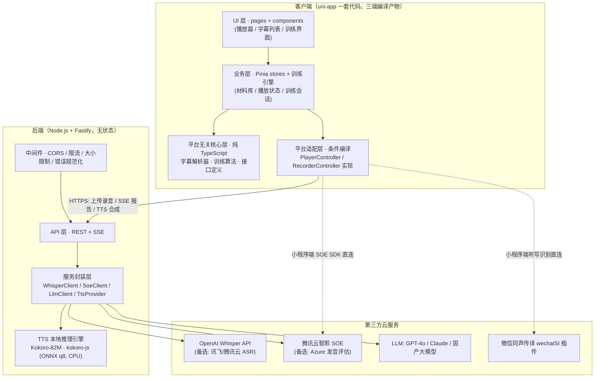
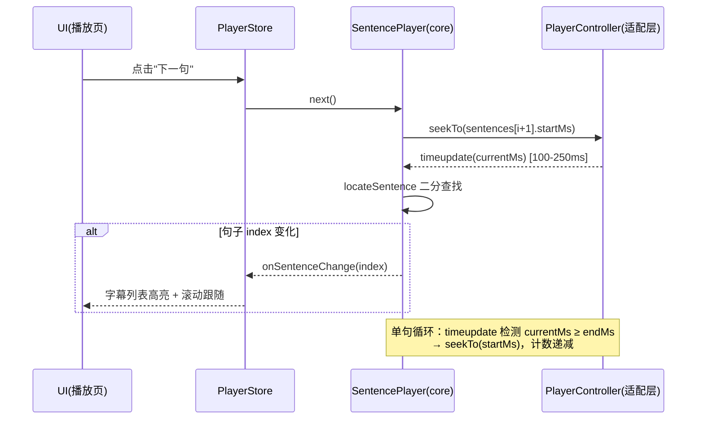
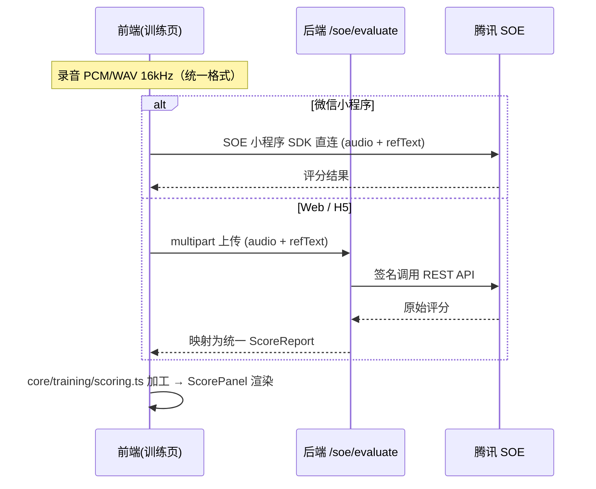
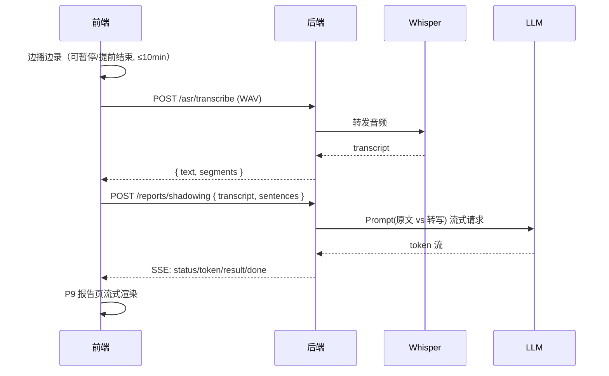
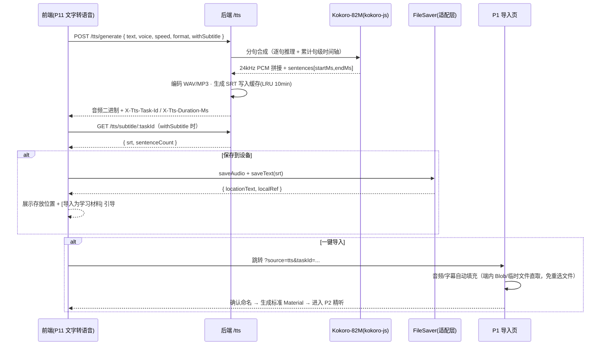
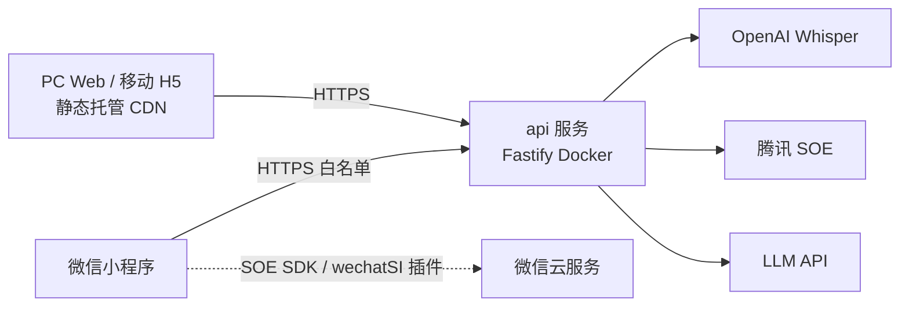

# 英语学习助手 · 系统架构设计

> 版本：v1.1 · 状态：待评审
> 变更记录：v1.1（2026-08-24）新增「文字转语音（Kokoro-82M）」功能——ADR-7、§2.8 FileSaver、§3.3-⑥⑦、§5.5 链路、§9 里程碑调整
> 设计依据：《技术选型报告》（docs/技术选型报告.md）、《原型设计》（docs/原型设计.md）
> 本文档的所有技术决策均落在选型报告的推荐结论上，不引入新框架。

---

## 1. 架构总览

### 1.1 架构目标与约束

| 目标 | 说明 |
|------|------|
| 三端一套代码 | uni-app (Vue 3) 编译 PC Web / 移动 H5 / 微信小程序，UI 与业务层复用最大化 |
| 平台差异收敛 | 播放、录音等平台相关能力全部收敛进适配层，通过条件编译隔离 |
| 云服务统一出口 | ASR / SOE / LLM 密钥与域名白名单收敛到轻量后端 |
| 本地优先 | 媒体与字幕文件存端内本地，后端无状态、无数据库（MVP） |

**硬约束**（来自选型报告）：
- 小程序不可用任何 DOM/Canvas 播放器库 → 原生 `<video>` / `InnerAudioContext`。
- 录音格式三端不统一 → 统一约定上传 PCM/WAV 16kHz。
- LLM API Key 不可暴露前端 → 必须后端代理；小程序需域名白名单。

### 1.2 总体架构图



**三条架构主线**（与选型报告 §5.2 对应）：
1. uni-app 条件编译承载三端适配层，不可复用的音视频代码（约 15-25%）收敛进 `platform/`，UI 与业务层（60-70%）完全复用。
2. 自研字幕解析器输出 `SubtitleData`，是播放控制与训练模式的共同数据源。
3. 后端是所有云服务的统一出口，同时解决密钥安全、域名白名单、Prompt 管理、限流缓存四件事。

### 1.3 核心架构决策摘要（ADR）

| 编号 | 决策 | 理由 | 备选/退路 |
|------|------|------|----------|
| ADR-1 | 播放/录音能力定义为 TS 接口 + 三端适配实现 | 三端 API 差异大但语义一致；上层业务零分支 | 抽象层保证 ArtPlayer↔xgplayer、Howler↔原生 audio 可替换 |
| ADR-2 | 字幕解析器自研，零依赖纯 TS | 双语拆分必须自研；SRT/LRC 解析本身极简；三端通用 | srt-parser-2 + 自研双语处理 |
| ADR-3 | 后端采用 Node.js 20 + Fastify + TypeScript，无状态无库 | 接口仅 5 个左右，代理+串联调用为主；与前端语言统一 | NestJS（需更复杂模块体系时）；微信云开发（免运维快速上线时） |
| ADR-4 | 媒体/字幕/训练记录全部端内本地存储，MVP 不做账号体系 | 产品形态为"导入本地文件学习"；后端零存储成本、隐私合规简单 | V1.1 增加可选云同步（届时引入账号与对象存储） |
| ADR-5 | 录音统一 PCM/WAV 16kHz 单声道 | 同时满足腾讯 SOE 与 Whisper 输入要求，避免多套录音配置 | 各端原生格式 + 后端 ffmpeg 转码（增加后端复杂度，不取） |
| ADR-6 | 分析类链路（影子跟读/背诵）拆为"转写"与"报告"两步请求 | 大文件上传与 SSE 流式生成分离；转写结果可复用、可断点重试 | 单请求 multipart + SSE（上传失败需整体重来，不取） |
| ADR-7 | TTS 采用后端本地推理（Kokoro-82M · kokoro-js · ONNX q8），分句合成后拼接并同步生成 SRT | 三端体验一致（小程序无法运行 WASM/WebGPU 大模型）；82M 模型 CPU 推理快于实时；分句合成天然获得精确句级时间轴，免 ASR 对齐 | H5 端侧 kokoro-js 离线模式（V1.2 增强）；云 TTS（Azure Speech）作质量备选/降级 |

---

## 2. 前端架构（client）

### 2.1 分层模型

```
┌──────────────────────────────────────────────┐
│ UI 层（pages / components）                    │  ← 唯一感知 Vue/uni-app 的层
├──────────────────────────────────────────────┤
│ 业务层（stores / services）                    │  ← Pinia 状态、后端 API 客户端、SSE
├──────────────────────────────────────────────┤
│ 平台无关核心层（core/，纯 TypeScript，无框架）    │  ← 可在 node 环境直接单测
│   player 接口 · recorder 接口 · subtitle 解析   │
│   training 算法（拼词/听写 diff/评分加工）        │
├──────────────────────────────────────────────┤
│ 平台适配层（platform/，条件编译）                │
│   #ifdef H5 → ArtPlayer / Howler / Recorder.js │
│   #ifdef MP-WEIXIN → video / InnerAudioContext │
│                      / RecorderManager         │
└──────────────────────────────────────────────┘
```

**依赖规则**：上层可依赖下层，禁止反向依赖；`core/` 不允许 import 任何 Vue/uni-app API，保证纯 TS 可测、可移植。

### 2.2 PlayerController 抽象层

**接口定义**（`core/player/types.ts`）：

```typescript
/** 媒体来源 */
interface MediaSource {
  type: 'video' | 'audio';
  /** H5 为 ObjectURL/远程 URL；小程序为本地临时文件路径 */
  src: string;
}

type PlayerState = 'idle' | 'loading' | 'ready' | 'playing' | 'paused' | 'ended' | 'error';

interface PlayerEvents {
  /** 播放进度（各端原生频率：H5 ~4-60Hz，小程序 ~100-250ms） */
  timeupdate: (currentMs: number) => void;
  statechange: (state: PlayerState) => void;
  ended: () => void;
  error: (err: PlayerError) => void;
}

interface PlayerController {
  load(source: MediaSource): Promise<void>;
  play(): Promise<void>;
  pause(): void;
  /** seek 到毫秒位置；小程序实现内部做精度补偿（见 §5.1） */
  seekTo(ms: number): void;
  setRate(rate: number): void;          // 0.5 ~ 2.0
  setVolume(volume: number): void;      // 0 ~ 1，小程序音频忽略
  /** 开启 A-B 循环（单句循环），循环区间 [startMs, endMs] */
  setLoop(startMs: number, endMs: number): void;
  clearLoop(): void;
  getCurrentTimeMs(): number;
  getDurationMs(): number;
  on<E extends keyof PlayerEvents>(event: E, cb: PlayerEvents[E]): void;
  off<E extends keyof PlayerEvents>(event: E, cb: PlayerEvents[E]): void;
  destroy(): void;
}
```

**三端实现**（`platform/player/`，条件编译入口 `platform/player/index.ts`）：

| 实现类 | 平台/场景 | 关键机制 |
|--------|-----------|---------|
| `ArtPlayerAdapter` | H5 视频 | ArtPlayer 实例；`art.currentTime`、`art.playbackRate`；循环在 `timeupdate` 中判断 `currentMs >= endMs → seek(startMs)` |
| `HowlerAdapter` | H5 音频 | Howler.js；循环用 sprite 定义 `[startMs, endMs-startMs, loop]`，天然 A-B loop；倍速 `howl.rate()` |
| `MpVideoAdapter` | 小程序视频 | 页面 `<video>` 组件 + `VideoContext`；`seek(s)`、`playbackRate`；循环在 `bindtimeupdate` 中判断 |
| `MpInnerAudioAdapter` | 小程序音频 | `InnerAudioContext`；`seek(s)`、`playbackRate`；需后台播放时切换为 `BackgroundAudioManager`（同接口另一实现 `MpBackgroundAudioAdapter`） |

**工厂**（条件编译选择实现，调用方无感知）：

```typescript
export function createPlayer(type: 'video' | 'audio'): PlayerController {
  // #ifdef H5
  return type === 'video' ? new ArtPlayerAdapter() : new HowlerAdapter();
  // #endif
  // #ifdef MP-WEIXIN
  return type === 'video' ? new MpVideoAdapter() : new MpInnerAudioAdapter();
  // #endif
}
```

**句子级控制**（`core/player/sentence-player.ts`，组合 PlayerController + SubtitleData，供业务层直接使用）：

| 方法 | 实现 |
|------|------|
| `playSentence(i)` | `seekTo(sentences[i].startMs)` + `play()` |
| `next() / prev()` | `playSentence(current ± 1)`，边界 clamp |
| `loopSentence(i, times)` | `setLoop(startMs, endMs)` + 计数；达到次数后 `clearLoop()` |
| `locateSentence(currentMs)` | 对 `sentences` 按 `startMs` 二分查找，返回 index；驱动字幕高亮 |
| `onSentenceChange` | 内部订阅 `timeupdate`，index 变化时才派发给上层（避免高频 setData） |

### 2.3 RecorderController 抽象层

```typescript
interface RecordOptions {
  format: 'pcm' | 'wav';
  sampleRate: 16000;      // 固定 16kHz，满足 SOE + Whisper
  channels: 1;            // 单声道
  maxDurationMs?: number; // 默认 600000（小程序硬上限 10 分钟）
}

interface RecordedAudio {
  /** H5 为 Blob（wav），小程序为本地临时文件路径（pcm/wav） */
  blob?: Blob;
  tempFilePath?: string;
  durationMs: number;
  sampleRate: number;
}

interface RecorderEvents {
  volume: (level: number) => void;   // 驱动录音按钮声波动画
  maxreach: () => void;              // 到达时长上限自动停止
  error: (err: RecorderError) => void;
}

interface RecorderController {
  start(options?: Partial<RecordOptions>): Promise<void>; // 内部申请麦克风权限
  pause(): void;    // 影子跟读/背诵可暂停
  resume(): void;
  stop(): Promise<RecordedAudio>;
  cancel(): void;
  on<E extends keyof RecorderEvents>(event: E, cb: RecorderEvents[E]): void;
  destroy(): void;
}
```

| 实现类 | 平台 | 要点 |
|--------|------|------|
| `RecorderJsAdapter` | H5 | Recorder.js（xiangyuecn），直接产出 WAV/PCM 16kHz，规避 MediaRecorder 输出 webm/mp4 的三端不一致问题；iOS Safari 必须用户手势触发（录音按钮点击即满足） |
| `WxRecorderAdapter` | 小程序 | `wx.getRecorderManager()`，`format: 'pcm'`、`sampleRate: 16000`、`encodeBitRate` 默认；边播边录时按设置引导 `audioSource: 'voice_communication'`（有回声消除，音质略降）或不设（音质好，需耳机） |

### 2.4 字幕解析模块（core/subtitle/）

**模块结构**：

```
core/subtitle/
├── model.ts        # SubtitleSentence / SubtitleData 类型（与选型报告 §2.4 一致）
├── timestamp.ts    # "00:00:02,610" / "[02:33.50]" → ms
├── srt.ts          # parseSrt(text): RawBlock[]
├── lrc.ts          # parseLrc(text): RawBlock[]
├── bilingual.ts    # 双语拆分：块内多行 → textEn / textZh
└── index.ts        # parseSubtitle(text, format?): SubtitleData
```

**双语拆分规则**（bilingual.ts，启发式 + 可配置）：

1. 块内按行分组，去除序号行与时间轴行后的文本行参与判定。
2. 判定函数 `isCJK(line)`：含中日韩统一表意字符 → 中文行。
3. 常见模式依次匹配：
   - 两行且上英下中（本项目样本格式）→ 上 `textEn`、下 `textZh`；
   - 两行且上中下英 → 反序；
   - 单行 → `textEn`，`textZh = null`；
   - 多行（>2）→ 连续英文行合并为 `textEn`，连续中文行合并为 `textZh`。
4. 全文统计：含 `textZh` 的句子占比 >30% → `isBilingual = true`。
5. LRC 无结束时间：`endMs = 下一句 startMs`；末句 `endMs = totalDurationMs`。
6. `words`：`textEn` 按空格切分并剥离首尾标点（保留撇号，如 `don't` 为一个词）。

**容错策略**（参考 srt-parser-2）：时间戳分隔符 `,`/`.` 均兼容；块间空行数量不敏感；序号缺失时按出现顺序补号；UTF-8 BOM 去除；解析失败抛出带行号的 `SubtitleParseError`，供导入页就地提示。

### 2.5 训练引擎（core/training/，纯 TS）

| 模块 | 职责 | 关键函数 |
|------|------|---------|
| `puzzle.ts` | 九宫格词块 | `buildTiles(sentence): Tile[]`（拆词+洗牌，词数>15 时按标点并块）；`checkAnswer(picked, sentence): {firstErrorIndex}` |
| `dictation-diff.ts` | 听写对比 | `normalize(s)`：小写、去标点、压缩空格；`diffWords(input, target): DiffToken[]`（逐词 LCS diff，输出 correct/wrong/missing/extra 四类标记供 UI 着色） |
| `scoring.ts` | 评分加工 | SOE 原始结果 → `ScoreReport { total, accuracy, fluency, integrity, words[{text, score, phonemes}] }`；阈值标色规则（词 <60 标红） |
| `session.ts` | 训练会话状态机 | `createSession(mode, sentences)`：题目队列、当前句推进、结果收集、小结汇总；与 UI 框架无关 |

### 2.6 状态管理（Pinia）

| Store | 状态 | 说明 |
|-------|------|------|
| `useMaterialStore` | `materials[]`、`currentMaterial`、`subtitleData`、`progressMap`、`favorites[]` | 材料 CRUD、导入解析、进度/收藏持久化 |
| `usePlayerStore` | `state`、`rate`、`volume`、`subtitleMode('both'/'en'/'zh'/'off')`、`currentSentenceIndex`、`loopConfig` | 持有当前 `SentencePlayer` 实例（非响应式，markRaw）；三态切换全局生效 |
| `useTrainingStore` | `session`、`recordings[]`、`reportStream` | 训练模式统一会话；P9 报告数据 |
| `useSettingsStore` | 默认倍速、循环次数、录音交互方式（按住/点按）、耳机提示开关、后台播放开关 | 持久化到本地 |

**性能要点**：`timeupdate` 高频回调只更新 `currentSentenceIndex`（index 不变不触发渲染）；字幕列表 >200 句启用虚拟滚动；小程序端避免把整棵 `subtitleData` 放响应式深层对象（用 `shallowRef`）。

### 2.7 路由（pages.json）

| 路径 | 页面 | 导航栏 |
|------|------|--------|
| `pages/index/index` | 材料库（Tab） | 标题"材料库" |
| `pages/settings/index` | 我的（Tab） | 标题"我的" |
| `pages/import/index` | 导入材料 | 返回 |
| `pages/player/index?materialId=` | 精听播放器 | 返回 + 材料名 |
| `pages/training/index?materialId=` | 训练中心 | 返回 |
| `pages/training/puzzle` / `dictation` / `read-aloud` / `shadowing` / `recitation` / `report` | 训练页与报告 | 返回 |
| `pages/tts/index` | 文字转语音（P11，v1.1 新增） | 返回 |

播放器/训练页不带 `materialId` 直达时，从 `useMaterialStore.currentMaterial` 恢复；均无则跳回材料库。

### 2.8 文件保存适配层（FileSaver，v1.1 新增）

TTS 产物"保存到用户设备"三端机制差异大，与 Player/Recorder 一样抽象为统一接口（`platform/saver/`）：

```typescript
interface SaveResult {
  /** 展示给用户的存放位置描述 */
  locationText: string;
  /** 端内引用（H5 为 Blob key，小程序为 savedFilePath/临时文件路径），供"一键导入"直接取用 */
  localRef: string;
}

interface FileSaver {
  /** 保存音频文件到用户设备；小程序触发系统目录选择 */
  saveAudio(data: Blob | string /* 小程序临时文件路径 */, fileName: string): Promise<SaveResult>;
  /** 保存文本文件（如 SRT 字幕） */
  saveText(text: string, fileName: string): Promise<SaveResult>;
}
```

| 实现 | 机制 | locationText 示例 |
|------|------|------------------|
| `WebSaver`（PC/H5） | Blob → `a[download]` 触发浏览器下载 | "浏览器默认下载目录（通常为 ~/Downloads）" |
| `WxSaver`（小程序） | 临时文件 → `wx.saveFileToDisk`（基础库 2.27.1+，用户自选目录）；不支持的客户端兜底 `wx.shareFileMessage` 发送到聊天 | 成功回调返回的 `savedFilePath` |

---

## 3. 后端架构（server）

### 3.1 职责定位

核心职责（选型报告 §4.4 + v1.1 扩展）：**密钥保管、小程序域名白名单代理、Prompt 管理、限流缓存、本地 TTS 推理**。不存业务数据、不管账号（MVP）。

技术栈：Node.js 20 + Fastify 4 + TypeScript。选 Fastify 而非 NestJS：接口仅 5 个、以代理与流式转发为主，Fastify 更轻、启动快、自带 schema 校验。退路：业务复杂化后可平滑演进 NestJS；要免运维可迁移微信云开发（云函数形态与 Fastify 路由一一对应）。

### 3.2 模块结构

```
server/src/
├── app.ts                 # Fastify 实例装配
├── config/                # env 加载与校验（zod）
├── plugins/               # cors / rate-limit / multipart / error-handler
├── routes/
│   ├── asr.route.ts       # POST /api/v1/asr/transcribe
│   ├── soe.route.ts       # POST /api/v1/soe/evaluate
│   ├── tts.route.ts       # POST /api/v1/tts/generate · GET /api/v1/tts/subtitle/:taskId
│   ├── report.route.ts    # POST /api/v1/reports/shadowing | recitation (SSE)
│   └── explain.route.ts   # POST /api/v1/llm/explain (SSE)
├── services/
│   ├── asr/
│   │   ├── asr-provider.ts        # 接口 AsrProvider
│   │   ├── whisper.provider.ts    # OpenAI Whisper（默认）
│   │   └── xunfei.provider.ts     # 讯飞（降级备选）
│   ├── tts/
│   │   ├── tts-provider.ts        # 接口 TtsProvider
│   │   └── kokoro.provider.ts     # Kokoro-82M 本地推理（kokoro-js · ONNX q8）
│   ├── soe/soe.client.ts          # 腾讯云智聆 SOE 签名与调用
│   └── llm/
│       ├── llm-provider.ts        # 接口 LlmProvider（streamChat）
│       ├── openai.provider.ts     # GPT-4o / 4o-mini
│       └── anthropic.provider.ts  # Claude（备选）
├── prompts/               # Prompt 模板（shadowing.md / recitation.md / explain.md）
└── lib/                   # SSE 写出器、临时文件清理、错误码
```

**Provider 接口抽象**：`AsrProvider.transcribe(audio, lang): Promise<TranscriptResult>`、`LlmProvider.streamChat(prompt, onToken): Promise<void>`、`TtsProvider.synthesize(input): Promise<TtsResult>`。环境变量切换实现（如 `ASR_PROVIDER=xunfei`、`TTS_PROVIDER=azure`），对应选型报告的降级策略。

```typescript
interface TtsInput { text: string; voice: string; speed: number; format: 'wav' | 'mp3'; }
interface TtsResult {
  audio: Buffer;                   // 编码后的音频文件内容
  durationMs: number;
  /** 分句合成得到的句级时间轴，用于生成 SRT（真实合成边界，非 ASR 推断） */
  sentences: { startMs: number; endMs: number; text: string }[];
}
```

### 3.3 API 契约

统一约定：
- 错误格式 `{ code: string, message: string, detail? }`；HTTP 状态语义化（400 参数错 / 413 音频过大 / 429 限流 / 502 上游云服务失败）。
- 音频上传走 `multipart/form-data`，单文件 ≤25MB（Whisper 上限）。
- SSE 端点响应 `text/event-stream`，事件序列：`status`（阶段进度）→ `token`（流式文本）→ `result`（结构化 JSON）→ `done` / `error`。

**① POST /api/v1/asr/transcribe** — 录音转写（影子跟读/背诵第一步；Web 端听写识别）

```
请求: multipart
  - audio: 文件 (wav/pcm 16kHz mono)
  - lang: "en"
响应 200:
  { "text": "You should answer...", "durationMs": 753000,
    "segments": [{ "startMs": 0, "endMs": 2600, "text": "..." }] }
```

**② POST /api/v1/soe/evaluate** — 发音评分代理（Web/H5 端跟读评分；小程序端走 SDK 直连不调此接口）

```
请求: multipart
  - audio: 文件 (wav/pcm 16kHz mono)
  - refText: "You should answer the questions as you listen."
  - evalMode: "sentence"
响应 200:
  { "total": 82, "accuracy": 85, "fluency": 78, "integrity": 90,
    "words": [{ "text": "answer", "score": 55,
                "phonemes": [{ "symbol": "æ", "score": 40 }] }] }
```

**③ POST /api/v1/reports/shadowing** — 影子跟读报告（SSE）；**④ /reports/recitation** — 背诵报告（SSE）

```
请求: application/json
  { "transcript": "...",              // ① 的转写结果（前端可编辑修正）
    "sentences": [{ "index":0, "textEn":"...", "textZh":"..." }, ...],
    "materialTitle": "真题模拟 001" }
SSE 事件:
  event: status  data: {"stage":"comparing"}
  event: token   data: {"text":"本次跟读"}        // 流式 Markdown
  event: result  data: {"total":82,"completeness":85,
                        "accuracy":78,"fluency":80} // 结构化评分
  event: done    data: {}
```

**⑤ POST /api/v1/llm/explain** — 单词/句子讲解（SSE，V1.3 词典点查预置，MVP 可不上线）

**⑥ POST /api/v1/tts/generate** — 文字转语音（Kokoro-82M，v1.1 新增）

```
请求: application/json
  { "text": "You should answer...",   // 上限 5000 字符，超限返回 400
    "voice": "af_heart",              // Kokoro 声音 ID，见 §3.4
    "speed": 1.0,                     // 0.5 ~ 2.0
    "format": "wav",                  // wav（默认）| mp3（需镜像内 ffmpeg）
    "withSubtitle": true }            // 是否生成分句对齐的 SRT
响应 200:
  Body: 音频二进制（Content-Type: audio/wav | audio/mpeg）
  Headers:
    X-Tts-Task-Id: "tk_01J..."        // 字幕领取凭据
    X-Tts-Duration-Ms: "7530"
    X-Tts-Sentence-Count: "3"
```

**⑦ GET /api/v1/tts/subtitle/:taskId** — 领取生成的字幕（withSubtitle=true 时，v1.1 新增）

```
响应 200:
  { "srt": "1\n00:00:00,000 --> 00:00:02,610\nYou should...\n", "sentenceCount": 3 }
说明: 字幕存于后端内存缓存（LRU 500 条，TTL 10 分钟），随音频生成时一并写入；
     音频二进制与字幕分离返回，兼容小程序 wx.request(arraybuffer) 与 wx.downloadFile 两种落地方式。
```

### 3.4 云服务封装要点

| 服务 | 封装要点 |
|------|---------|
| Whisper | 上传临时文件流式转发；失败按错误码重试一次；超时 60s；`ASR_PROVIDER` 可切讯飞/腾讯 ASR |
| 腾讯 SOE | 服务端签名（SecretId/Key 存 env）；音频 base64 内嵌请求体；`ServerType=0`（英文）；结果字段映射为内部 `ScoreReport` 模型，屏蔽厂商差异（Azure 备用时同样映射） |
| LLM | Prompt 模板文件 + 变量插值（transcript、sentences、维度要求 JSON Schema）；要求模型在末尾输出 `---RESULT---` 后的 JSON 评分块，服务端解析后拆成 `token`/`result` 两类 SSE 事件；超时 120s，断流即 `error` 事件 |
| Kokoro TTS（本地推理） | kokoro-js（Node 模式）加载 onnx-community/Kokoro-82M-v1.0-ONNX（q8，约 90MB），启动预热常驻内存（约 400-600MB）；按 `[.!?;:\n]` 分句逐句推理后拼接 24kHz PCM，累计每句 `startMs/endMs` 直接产出 SRT，无需 ASR 对齐；并发信号量 2（CPU 密集）；整体超时 120s；内置声音：af_heart（默认·美式女声）/ af_bella / am_michael（美式男声）/ bf_emma（英式女声）等 |

### 3.5 限流、缓存与安全

| 项 | 设计 |
|----|------|
| 限流 | `@fastify/rate-limit`：默认每 IP 100 次/分钟；`/soe/evaluate`、`/asr/transcribe` 收紧至 20 次/分钟；`/tts/generate` 收紧至 10 次/分钟（CPU 密集）；超限 429 |
| 缓存 | 相同音频哈希 + refText 的 SOE 结果内存缓存 10 分钟（LRU 1000 条）；LLM 报告按 `hash(transcript+sentences)` 缓存 1 小时；TTS 字幕按 taskId 缓存 10 分钟（LRU 500 条，§3.3-⑦） |
| 上传安全 | multipart 大小限制 25MB；MIME/魔数校验（RIFF/WAV、PCM 长度校验）；临时文件写后即删（`finally` 清理 + 定期清扫）；TTS 文本上限 5000 字符、剔除控制字符防滥用 |
| 密钥 | 全部存 `.env`（不入仓），zod 启动校验缺失即拒启 |
| CORS | 白名单 = H5 部署域名；小程序端无 CORS 概念但校验 `User-Agent`/Referer 仅供参考，主要依赖限流 |
| 录音隐私 | 音频处理完即删，不落盘存储；可选 `RECORDING_RETENTION_HOURS` 支持 24h 回听（默认 0） |

---

## 4. 数据模型

### 4.1 前端核心模型（src/types/）

字幕模型直接采用选型报告 §2.4 定义（`SubtitleSentence` / `SubtitleData`），以下为业务模型：

```typescript
/** 学习材料（元数据，媒体与字幕文件本体存端内文件系统） */
interface Material {
  id: string;                      // nanoid
  name: string;
  mediaType: 'video' | 'audio';
  /** 端内本地引用：H5 为 IndexedDB 中的 Blob key，小程序为本地文件路径 */
  mediaRef: string;
  mediaFileName: string;
  mediaSizeBytes: number;
  subtitle: {
    ref: string;                   // 字幕文件本地引用
    format: 'srt' | 'lrc';
    isBilingual: boolean;
    sentenceCount: number;
  } | null;
  durationMs: number;
  createdAt: number;
  lastOpenedAt: number;
}

/** 学习进度（每材料一条） */
interface LearningProgress {
  materialId: string;
  lastPositionMs: number;
  playedSentenceIndexes: number[]; // 精听/训练中播放过的句子，驱动材料库进度条
  updatedAt: number;
}

/** 句子收藏 */
interface Favorite {
  materialId: string;
  sentenceIndex: number;
  createdAt: number;
}

/** 训练记录（五模式联合类型） */
interface TrainingRecord {
  id: string;
  materialId: string;
  mode: 'puzzle' | 'dictation' | 'read-aloud' | 'shadowing' | 'recitation';
  scope: { type: 'all' } | { type: 'favorites' };
  score: number;                   // 各模式归一化综合分（0-100）
  detail: PuzzleDetail | DictationDetail | ReadAloudDetail | ReportDetail;
  createdAt: number;
}
```

### 4.2 本地持久化设计

| 数据 | H5 (PC/移动) | 微信小程序 | 备注 |
|------|-------------|-----------|------|
| 材料/进度/收藏/训练记录 | IndexedDB（`idb` 封装） | `wx.setStorage`（元数据 <10MB 限额内） | 结构同上，KV 存储 |
| 媒体文件（可能数百 MB） | IndexedDB Blob（或 OPFS，Chrome 86+） | `wx.getFileSystemManager()` 保存到 `wx.env.USER_DATA_PATH` | 导入时 `chooseMessageFile` 得到的临时文件需**立即另存**防止被清理 |
| 字幕解析结果 `SubtitleData` | 随材料元数据同存（JSON） | 同左 | 避免每次启动重复解析 |
| 设置项 | localStorage | Storage | 小数据 |

**容量治理**：材料卡片显示占用空间；设置页提供"清理录音缓存/删除材料"；小程序端删除材料时同步删除 USER_DATA_PATH 文件。

**TTS 产物**：生成的音频/字幕经"一键导入"后即成为标准 `Material`（§4.1），不引入新数据模型；仅保存到设备而未导入的产物不在端内做长期管理；P11 生成记录（音频+字幕端内缓存，24h）支持重复导入。

---

## 5. 关键链路设计

### 5.1 逐句精听与 A-B 循环（含小程序 seek 补偿）



**小程序 seek 精度补偿**（`MpInnerAudioAdapter` 内部）：
- `seekTo(target)` 后记录目标值；下一次 `onTimeUpdate` 若实际位置与目标偏差 >300ms 且方向一致，在后续循环边界判断中以实际落点修正 `endMs` 容差（±250ms）。
- 循环边界判断使用 `>=` 加容差，防止因回调间隔（100-250ms）越过边界漏触发。

### 5.2 单句听写识别链路（分端）

```
小程序端: 用户跟读/听写语音 → wechatSI 插件(实时流式) → 识别文本 → core/training/dictation-diff 本地对比
Web/H5 端: 录音(WAV 16k) → POST /asr/transcribe → Whisper → 识别文本 → 同一 diff 算法本地对比
```

两条链路在 `services/dictation-asr.ts` 中按 `#ifdef` 分流，向上暴露同一接口 `recognize(audio): Promise<string>`。

### 5.3 跟读评分链路（分端）



SDK 直连与后端代理返回的原始字段不同，统一在 `scoring.ts` 归一为 `ScoreReport`，UI 无感知。

### 5.4 影子跟读链路（ADR-6 两段式）



全文背诵链路相同，仅 Prompt 模板不同（`prompts/recitation.md`，侧重完整度/记忆准确度评估）。

### 5.5 文字转语音（TTS）与一键导入链路（v1.1 新增）



**要点**：

- 句级时间轴来自分句合成的真实边界（而非 ASR 对齐），导入后即支持全部逐句能力（上下句 / 单句循环 / 五种训练模式）。
- "一键导入"完整复用 P1 导入页的解析与入库流程，TTS 带入与手工选文件仅是数据来源差异，不产生新数据模型（ADR-7）。
- 小程序端音频经 `wx.downloadFile`（或 arraybuffer 写文件）落地临时文件后，即可直接用于材料入库与 `wx.saveFileToDisk` 保存。

### 5.6 降级矩阵（与选型报告 §6 对应）

| 链路 | 一级失败 | 降级行为 |
|------|---------|---------|
| 听写识别（小程序 wechatSI） | 插件不可用/识别失败 | 切换到后端 Whisper 通道 |
| Whisper | 网络失败/超时 | 自动切换 `ASR_PROVIDER=xunfei` 讯飞；仍失败则提示重试，录音本地保留 |
| SOE | 调用失败 | 保留录音，允许就地重试；连续失败提示稍后再试 |
| LLM 报告 | 流式中断 | P9 降级展示 ASR 转写与原文的逐句 diff（前端本地计算），标注"AI 分析暂不可用" |
| TTS 生成 | 推理失败/超时 | 文本保留并提示重试；连续失败可切换云 TTS 备选（Azure Speech，`TTS_PROVIDER=azure`，需预置密钥）；字幕生成失败时仍可只下载音频 |

---

## 6. 项目目录结构

```
ping-english-assistant/
├── client/                          # uni-app 前端（三端产物）
│   ├── src/
│   │   ├── pages/                   # P0-P11 页面（见原型设计 §2.1）
│   │   │   ├── index/  import/  player/  settings/  tts/
│   │   │   └── training/  (index/puzzle/dictation/read-aloud/shadowing/recitation/report)
│   │   ├── components/
│   │   │   ├── player/              # PlayerControlBar / SubtitleList / SentenceItem / SubtitleOverlay
│   │   │   └── training/            # RecordButton / ScorePanel / WordTileGrid / DictationInput
│   │   ├── core/                    # ★ 平台无关纯 TS（node 环境直接单测）
│   │   │   ├── player/              # types.ts / sentence-player.ts
│   │   │   ├── recorder/            # types.ts
│   │   │   ├── subtitle/            # srt / lrc / bilingual / model / timestamp
│   │   │   └── training/            # puzzle / dictation-diff / scoring / session
│   │   ├── platform/                # ★ 条件编译适配层
│   │   │   ├── player/              # art-player / howler / mp-video / mp-audio 适配器 + 工厂
│   │   │   ├── recorder/            # recorder-js / wx-recorder 适配器 + 工厂
│   │   │   ├── saver/               # web-saver / wx-saver 适配器 + 工厂（TTS 产物保存）
│   │   │   └── storage/             # idb / wx-storage 适配器 + 工厂
│   │   ├── services/                # api-client.ts / sse.ts / dictation-asr.ts / soe-client.ts / tts-client.ts
│   │   ├── stores/                  # material / player / training / settings (Pinia)
│   │   ├── types/                   # Material / TrainingRecord 等业务模型
│   │   ├── utils/                   # format / id / cjk / file
│   │   ├── App.vue  main.ts  pages.json  manifest.json  uni.scss
│   └── package.json  vite.config.ts  tsconfig.json
├── server/                          # Fastify 后端
│   ├── src/  (见 §3.2)
│   ├── test/
│   ├── .env.example                 # OPENAI_API_KEY / TENCENT_SOE_SECRET_* / ASR_PROVIDER / LLM_PROVIDER ...
│   └── package.json  tsconfig.json  Dockerfile
└── docs/
    ├── 技术选型报告.md
    ├── 原型设计.md
    └── 系统架构设计.md
```

---

## 7. 部署架构

| 端 | 形态 | 要点 |
|----|------|------|
| PC Web / 移动 H5 | 静态托管（Vercel / Nginx） | `uni build` H5 产物；录音/麦克风要求 HTTPS |
| 微信小程序 | 开发者工具上传 → 审核发布 | 后台配置 **request/uploadFile 合法域名** = 后端域名；引入 wechatSI 插件与 SOE SDK；`BackgroundAudioManager` 需在 app.json 声明 `requiredBackgroundModes: ["audio"]`（开启后台播放时） |
| 后端 | 单容器 Docker 部署（云主机/微信云托管） | HTTPS 必需（小程序强制 + getUserMedia 强制）；环境变量注入密钥；健康检查 `GET /health`；Kokoro 模型文件（q8 约 90MB）随镜像打包或启动时从对象存储拉取，内存 ≥1GB；需 MP3 输出时镜像内安装 ffmpeg |



---

## 8. 非功能性设计

### 8.1 性能

| 场景 | 指标/策略 |
|------|----------|
| 字幕高亮跟随 | `timeupdate` → 二分查找 O(log n)；index 不变不触发渲染；列表 >200 句虚拟滚动 |
| 小程序 setData 压力 | `subtitleData` 用 `shallowRef`；当前句 index 单独下发；循环判断在 JS 侧不依赖视图 |
| 大文件导入 | 媒体文件不经过 JS 内存全量读取：H5 用 Blob/OPFS 引用，小程序直接另存临时文件 |
| 首屏 | H5 首屏仅材料库，ArtPlayer/Howler 路由级懒加载；小程序分包：training 相关页入分包 |
| 后端 | SOE/LLM 结果缓存（§3.5）；Whisper 并发上限（信号量 10），多余排队；TTS 推理并发上限 2（CPU 密集，RTF<1 快于实时），模型启动预热避免首请求慢 |

### 8.2 可靠性

- 前端所有训练录音先落本地再上传，网络失败可重试不丢数据。
- 后端上游调用全部带超时（Whisper 60s / SOE 15s / LLM 120s）与单次重试；错误规范化后返回前端。
- 小程序端 seek/循环精度问题由适配层补偿（§5.1），UI 层无感知。

### 8.3 安全与合规

- 密钥仅存在于服务端 env；前端无任何云服务密钥（小程序 SOE SDK 使用微信生态内鉴权，不暴露 SecretKey）。
- 录音默认即用即删；报告不含原始音频。
- 本地数据为用户私有，无账号体系即无个人数据上传（MVP）。

---

## 9. 实施里程碑

| 里程碑 | 范围 | 预估 |
|--------|------|------|
| M1 精听骨架 | uni-app 工程初始化；字幕解析器（含单测）；PlayerController 三端实现；材料库/导入/播放器页 | 2.5 周 |
| M2 离线训练 | 训练引擎（puzzle/dictation-diff）；九宫格/单句听写页；训练中心；收藏与进度 | 1.5 周 |
| M3 文字转语音（v1.1 新增） | 后端 Kokoro-82M 接入与 /tts 路由；P11 页面；FileSaver 三端实现；生成→保存→一键导入闭环 | 1.5 周 |
| M4 语音评测 | RecorderController 双端实现；SOE 接入（小程序 SDK + 后端代理）；跟读评分页；后端 ASR/SOE 路由上线 | 2 周 |
| M5 LLM 报告 | 影子跟读/全文背诵页；后端 reports SSE；分析报告页 | 1.5 周 |
| M6 打磨发布 | 设置页；三端适配回归；性能优化；小程序提审、H5 上线 | 1 周 |

> 自研字幕解析器的 1-1.5 人天已包含在 M1 内；M3 起需后端先行部署联调环境（M3 完成 Docker 镜像与 Kokoro 模型打包验证，为 M4 语音链路铺路）。
